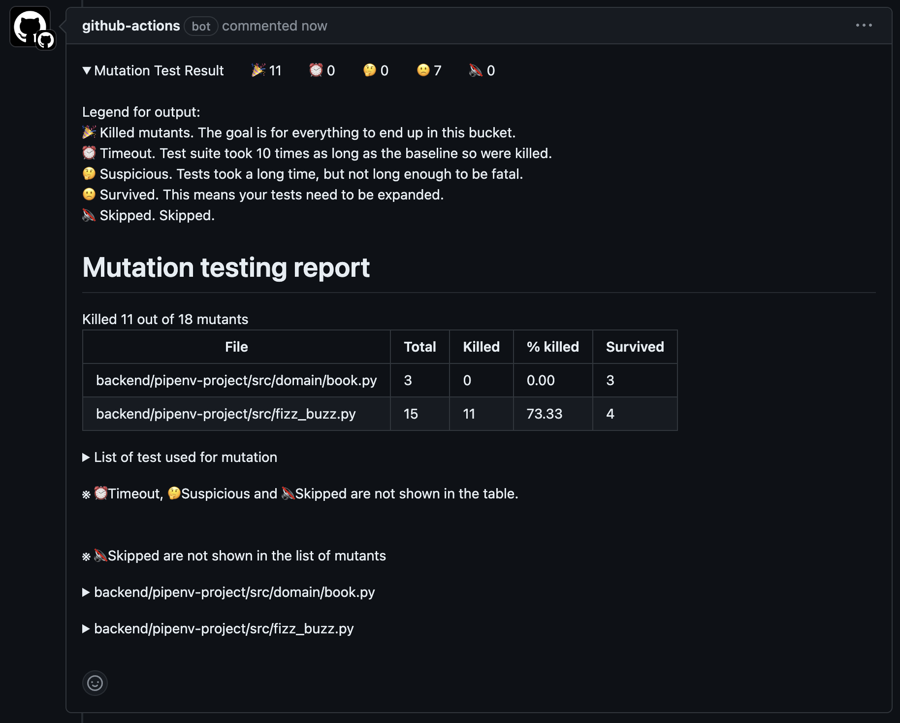

# python-mutation-report
This python-mutation-report performs a mutation test with `mutmut` of the pip package on the changed lines of file in the pull request,  
and comments the mutation test summary in the pull_request, as shown in the [example](docs/sample_summary_comment.md) below.

# TODO change image


## Example usage in workflow
```yml
on:
  pull_request:
    paths:
      - "python-project/src/**"
      - "python-project/tests/**"

jobs:
  python-mutation-testing-report:
    runs-on: ubuntu-latest
    name: Python mutation testing report
    timeout-minutes: 15
    permissions:
      pull-requests: write
      contents: read

    steps:
      - uses: Century-ss/python-mutation-report@main
        with:
          lock-file-path: "python-project/Pipfile.lock"
          src-directory: "python-project/src"
          test-directory: "python-project/tests"
          where-to-run-test: "python-project"
          python-version: "3.11"
```

## Notes
- Only `pull_request` events are supported.
- Perform mutation test only on `pull_request` changed lines in files under `src-directory`.
- Only `ubuntu` and `mac os` runners are supported.
- Only `pytest` is supported as a test module.
- `Write permission for pull_request` and `read permission for contents` is required.
- If there are many changed files in the pull_request, it may take longer, so it is recommended to set a `timeout-minutes`.

## How to find a combination of test and src files
- If the change diff has a `hoge.py` in the src file, trying to find `test_hoge.py` in the test directory
  - If `test_hoge.py` is found, include `hoge.py` and `test_hoge.py` in the mutation test.
  - If `test_hoge.py` is not found, not include `hoge.py` in the mutation test.
  - If multiple `test_hoge.py` is found, include them all in the mutation test.

## Inputs
- Required parameters
  - `lock-file-path`: Lock file path for installing python dependencies. The following lock files are supported.
    - Pip's `requirements.txt`
    - Pipenv's `Pipfile.lock`
    - Rye's `requirements-dev.lock` or `requirements.lock`.
  - `src-directory`: Directory path of the source to plant the mutant.
  - `test-directory`: Directory path of the test to evaluate the mutant.
- Optional parameters.
  - `where-to-run-test`: Path to the location where　test is run. Default is `"."`, it runs in the repository root directory.
  - `python-version`: Version of python used. Default is `"3.11"`

## Outputs
No outputs.
